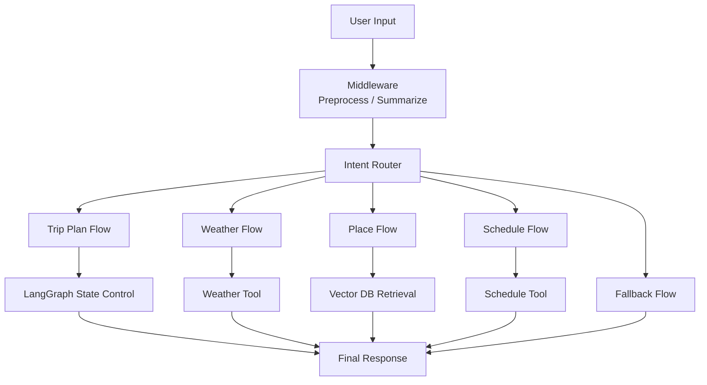
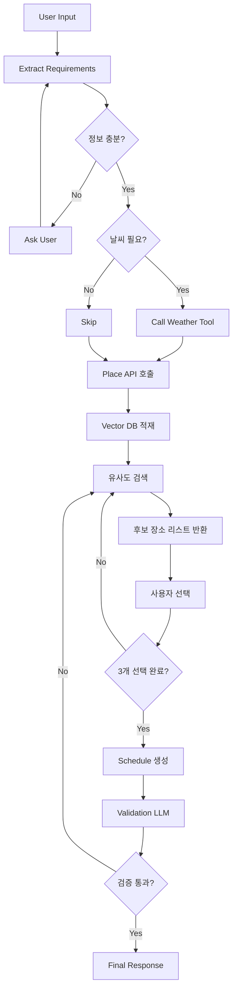
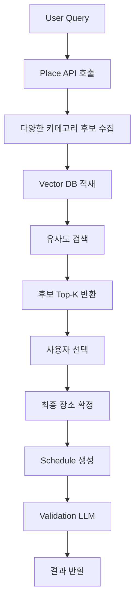

# 🌍 TRIP_DOT_ZIP

> **LLM 기반 대화형 여행 일정 추천 시스템**
> *대화를 통해 여행 조건을 수집하고, 장소를 추천하며, 최종 일정을 생성하는 AI Travel Agent*

---

## 📑 목차 (Table of Contents)

1. [📌 프로젝트 개요](#1-프로젝트-개요)
2. [🖐🏻 팀 소개](#2-팀-소개)
3. [🛠 기술 스택](#3-기술-스택)
4. [🧠 시스템 아키텍처](#4-시스템-아키텍처)
5. [🔁 데이터 흐름 (Trip Plan Flow)](#5-데이터-흐름-trip-plan-flow)
6. [🔀 기타 Flow](#6-기타-flow)
7. [🚀 주요 기능](#7-주요-기능)
8. [🤖 Agentic RAG 구조](#8-agentic-rag-구조)
9. [🧩 State 설계](#9-state-설계)
10. [⚙️ 설계 선택 이유](#10-설계-선택-이유)
11. [📁 프로젝트 구조](#11-프로젝트-구조)
12. [🎬 서비스 시나리오](#12-서비스-시나리오)
13. [💬 동료 회고](#13-동료-회고)

---

## 1. 📌 프로젝트 개요

### 📋 서비스 배경

* 여행 계획은 정보 탐색, 장소 선정, 동선 구성까지 많은 피로도를 요구
* 기존 추천 시스템은 정적인 리스트 제공에 그침

👉 본 프로젝트는
**LLM 기반 Agent 시스템을 활용하여 “대화형 여행 계획 자동화”**를 목표로 한다

---

### 🎯 핵심 목표

* LangGraph 기반 상태 제어형 Agent 구현
* LLM Function Calling 기반 Tool 자동 호출
* 사용자와의 대화를 통한 여행 조건 수집
* 상황(Context)에 맞는 동적 추천
* 최종 일정 자동 생성

---

### 💡 기대 효과

* 여행 준비 시간 단축
* 개인 맞춤형 일정 제공
* 실시간 상황(날씨 등) 반영

---

## 2. 🖐🏻 팀 소개

## Team Trip Dot ZIP

여행의 모든 순간을 연결하는 다섯 마리의 똑똑한 땃쥐들입니다!

|  |  |  |  | > |
| :-------------------------------------------------------------------------------------------------------------------: | :-------------------------------------------------------------------------------------------------------------------: | :-------------------------------------------------------------------------------------------------------------------: | :-------------------------------------------------------------------------------------------------------------------: | :--------------------------------------------------------------------------------------------------------------------: |
|                                                        **김이선**                                                        |                                                        **김지윤**                                                        |                                                        **박은지**                                                        |                                                        **위희찬**                                                        |                                                         **홍지윤**                                                        |
|                                                 🛠️                 팀원                                                |                                                         ✈️ 조장                                                         |                                                         🌰 팀원                                                         |                                                         🥜 대장                                                         |                                                         🗺️ 팀원                                                         |
|                                             middleware 및 <br> streamlit 연동                                            |                                                프로젝트 총괄 <br> LLM 프롬프트 설계                                               |                                                 상세 업무 내용 <br> 업데이트 예정                                                 |                                               기술 아키텍처 설계 <br> 에이전트 로직 구현                                              |                                                  상세 업무 내용 <br> 업데이트 예정                                                 |
|                                       [GitHub](https://github.com/kysuniv-cyber)                                      |                                     [GitHub](https://github.com/JiyounKim-EllyKim)                                    |                                         [GitHub](https://github.com/lo1f0306)                                         |                                         [GitHub](https://github.com/dnlgmlcks)                                        |                                          [GitHub](https://github.com/jyh-skn)                                          |

---

## 3. 🛠 기술 스택

### Core

* **LLM**: GPT-4o-mini
* **Framework**: LangGraph (State 기반 Flow 제어)

### Data & API

* OpenWeather API
* Google Places API

### Retrieval

* Chroma Vector DB
* SelfQueryRetriever

### Frontend & Visualization

* Streamlit
* Folium

---

## 4. 🧠 시스템 아키텍처



---

## 5. 🔁 데이터 흐름 (Trip Plan Flow 기준)

- 본 데이터 흐름은 전체 시스템 중 가장 핵심적인 "Trip Plan Flow" 기준으로 설명합니다.



---

## 6. 🔀 기타 Flow

Trip Plan Flow 외에도 사용자 요청에 따라 아래와 같은 Flow가 동작합니다.

- **Weather Flow**  
  → 특정 지역 및 날짜의 날씨 정보를 조회하고, 여행 관점에서 해석하여 제공

- **Place Flow**  
  → 일정 생성 없이 장소 추천만 수행 (Vector DB 기반 유사도 검색 활용)

- **Schedule Flow**  
  → 사용자가 선택한 장소 리스트를 기반으로 동선 및 시간표 생성

- **Fallback Flow**  
  → 일반 대화 또는 지원하지 않는 요청에 대한 응답 처리

---

## 7. 🚀 주요 기능

### 1️⃣ 대화형 여행 계획 생성

* 자연어 입력 기반 요구사항 추출
* 부족한 정보 자동 질문
* multi-turn 대화 구조

---

### 2️⃣ 날씨 기반 동적 추천

* Weather API 활용
* 날씨에 따라 추천 변경

---

### 3️⃣ Vector DB 기반 장소 추천 ⭐

* 리뷰 기반 의미 유사도 검색
* 단순 필터링이 아닌 semantic search

---

### 4️⃣ 사용자 선택 기반 장소 확정 ⭐

```text
후보 10개 제공 → 사용자 선택 → 3개 확정
```

---

### 5️⃣ 일정 생성

* 이동 시간 고려
* 동선 최적화

---

### 6️⃣ Validation LLM

* 일정 품질 검증
* 이동 시간 / 흐름 체크

---

## 8. 🤖 Agentic RAG 구조



---

## 9. 🧩 State 설계

```text
TravelPlannerState

- user_input
- intent
- destination
- styles
- constraints

- place_candidates
- selected_places

- weather_result
- schedule_result
```

---

## 10. ⚙️ 설계 선택 이유

### LangGraph

* 복잡한 분기 처리
* multi-turn 대화

### Vector DB

* 리뷰 기반 의미 검색

### 사용자 선택 방식

* 취향 반영 극대화

### Validation LLM

* 일정 품질 보장

---

## 11. 📁 프로젝트 구조

```text
src/
 ├── graph/
 ├── nodes/
 ├── retrieval/
 ├── tools/
 └── frontend/
```

---

## 12. 🎬 서비스 시나리오

**입력**

> “부산 당일치기, 실내 위주로 가고 싶어”

**출력**

* 장소 추천
* 사용자 선택
* 일정 생성
* 검증 완료 결과

---

## 🧠 한 줄 요약

> **LangGraph 기반 LLM Agent가 대화를 통해 여행 조건을 수집하고,
> Vector DB 기반 유사도 검색 + 사용자 선택을 통해 장소를 확정한 뒤,
> 일정을 생성하고 검증까지 수행하는 시스템**

---

<h2>13. 💬 동료 회고</h2>

<table>
  <thead>
    <tr>
      <th>대상자</th>
      <th>작성자</th>
      <th>회고 내용</th>
    </tr>
  </thead>
  <tbody>

    <!-- 김지윤 -->
    <tr>
      <td rowspan="4"><b>김지윤</b></td>
      <td>김이선</td>
      <td></td>
    </tr>
    <tr>
      <td>박은지</td>
      <td></td>
    </tr>
    <tr>
      <td>위희찬</td>
      <td></td>
    </tr>
    <tr>
      <td>홍지윤</td>
      <td></td>
    </tr>

    <!-- 김이선 -->
    <tr>
      <td rowspan="4"><b>김이선</b></td>
      <td>김지윤</td>
      <td></td>
    </tr>
    <tr>
      <td>박은지</td>
      <td></td>
    </tr>
    <tr>
      <td>위희찬</td>
      <td></td>
    </tr>
    <tr>
      <td>홍지윤</td>
      <td></td>
    </tr>

    <!-- 박은지 -->
    <tr>
      <td rowspan="4"><b>박은지</b></td>
      <td>김지윤</td>
      <td></td>
    </tr>
    <tr>
      <td>김이선</td>
      <td></td>
    </tr>
    <tr>
      <td>위희찬</td>
      <td></td>
    </tr>
    <tr>
      <td>홍지윤</td>
      <td></td>
    </tr>

    <!-- 위희찬 -->
    <tr>
      <td rowspan="4"><b>위희찬</b></td>
      <td>김지윤</td>
      <td></td>
    </tr>
    <tr>
      <td>김이선</td>
      <td></td>
    </tr>
    <tr>
      <td>박은지</td>
      <td></td>
    </tr>
    <tr>
      <td>홍지윤</td>
      <td></td>
    </tr>

    <!-- 홍지윤 -->
    <tr>
      <td rowspan="4"><b>홍지윤</b></td>
      <td>김지윤</td>
      <td></td>
    </tr>
    <tr>
      <td>김이선</td>
      <td></td>
    </tr>
    <tr>
      <td>박은지</td>
      <td></td>
    </tr>
    <tr>
      <td>위희찬</td>
      <td></td>
    </tr>

  </tbody>
</table>