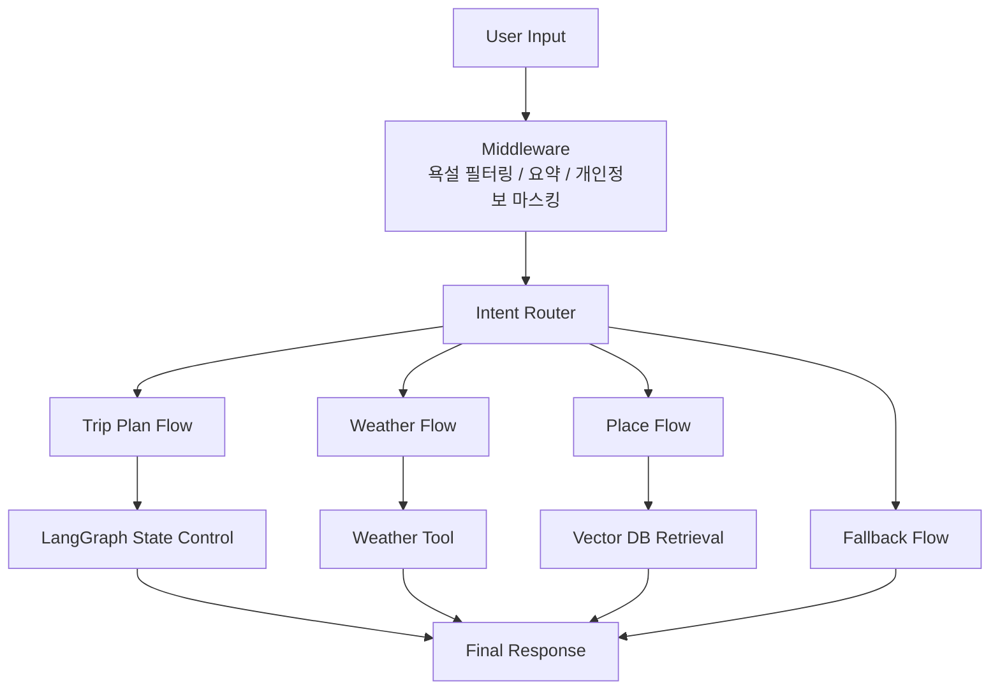
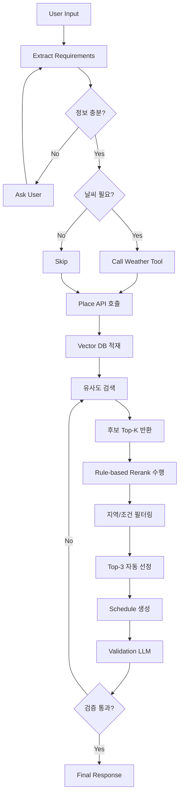
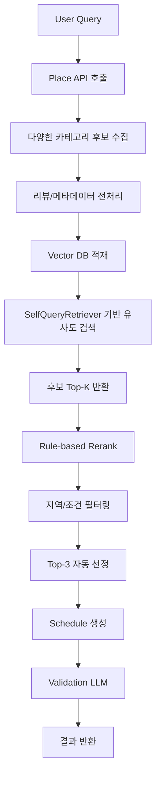

# 🌍 TRIP_DOT_ZIP

> **LLM 기반 대화형 여행 일정 추천 시스템**  
> *대화를 통해 여행 조건을 수집하고, 장소를 추천하며, 최종 일정을 생성하는 AI Travel Agent*

---

## 📑 목차 (Table of Contents)

1. [📌 프로젝트 개요](#1--프로젝트-개요)
2. [🖐🏻 팀 소개](#2--팀-소개)
3. [🛠 기술 스택](#3--기술-스택)
4. [🧠 시스템 아키텍처](#4--시스템-아키텍처)
5. [🔁 데이터 흐름 (Trip Plan Flow)](#5--데이터-흐름-trip-plan-flow-기준)
6. [🔀 기타 Flow](#6--기타-flow)
7. [🚀 주요 기능](#7--주요-기능)
8. [🤖 Agentic RAG 구조](#8--agentic-rag-구조)
9. [🧩 State 설계](#9--state-설계)
10. [⚙️ 설계 선택 이유](#10--설계-선택-이유)
11. [📁 프로젝트 구조](#11--프로젝트-구조)
12. [🎬 서비스 시나리오](#12--서비스-시나리오)
13. [🔮 한계 및 향후 개선 방향](#13--한계-및-향후-개선-방향)
14. [💬 동료 회고](#14--동료-회고)

---

## 1. 📌 프로젝트 개요

### 📋 서비스 배경

* 여행 계획은 정보 탐색, 장소 선정, 동선 구성까지 많은 피로도를 요구
* 기존 추천 시스템은 정적인 리스트 제공에 그침

👉 본 프로젝트는
**LLM 기반 Agent 시스템을 활용하여 “대화형 여행 계획 자동화”**를 목표로 한다

---

### 🎯 핵심 목표

* LangGraph 기반 상태 제어형 Agent 구현
* LLM Function Calling 기반 Tool 자동 호출
* 사용자와의 대화를 통한 여행 조건 수집
* 상황(Context)에 맞는 동적 추천
* 최종 일정 자동 생성

---

### 💡 기대 효과

* 여행 준비 시간 단축
* 개인 맞춤형 일정 제공
* 실시간 상황(날씨 등) 반영

---

## 2. 🖐🏻 팀 소개

### Team Trip Dot ZIP

여행의 모든 순간을 연결하는 다섯 마리의 똑똑한 땃쥐들입니다!

<table width="100%" border="0">
  <tr>
    <td width="20%" align="center">
      
    </td>
    <td width="20%" align="center">
      
    </td>
    <td width="20%" align="center">
      
    </td>
    <td width="20%" align="center">
      
    </td>
    <td width="20%" align="center">
      
    </td>
  </tr>

  <tr>
    <td width="20%" align="center"><b>김이선</b></td>
    <td width="20%" align="center"><b>김지윤</b></td>
    <td width="20%" align="center"><b>박은지</b></td>
    <td width="20%" align="center"><b>위희찬</b></td>
    <td width="20%" align="center"><b>홍지윤</b></td>
  </tr>

  <tr>
    <td width="20%" align="center">🛠️ 팀원</td>
    <td width="20%" align="center">✈️ 조장</td>
    <td width="20%" align="center">🌰 팀원</td>
    <td width="20%" align="center">🥜 대장</td>
    <td width="20%" align="center">🗺️ 팀원</td>
  </tr>

  <tr>
    <td width="20%" align="center">middleware 및<br>streamlit 연동</td>
    <td width="20%" align="center">프로젝트 총괄<br>LangGraph 기반 LLM 아키텍처 설계</td>
    <td width="20%" align="center">LangGraph 상태 관리 및 데이터 정합성 로직 고도화<br>멀티 에이전트 노드 설계</td>
    <td width="20%" align="center">기술 아키텍처 설계<br>에이전트 로직 구현</td>
    <td width="20%" align="center">AI 설계<br>데이터 설계<br>상태 관리</td>
  </tr>

  <tr>
    <td width="20%" align="center"><a href="https://github.com/kysuniv-cyber">GitHub</a></td>
    <td width="20%" align="center"><a href="https://github.com/JiyounKim-EllyKim">GitHub</a></td>
    <td width="20%" align="center"><a href="https://github.com/lo1f0306">GitHub</a></td>
    <td width="20%" align="center"><a href="https://github.com/dnlgmlcks">GitHub</a></td>
    <td width="20%" align="center"><a href="https://github.com/jyh-skn">GitHub</a></td>
  </tr>
</table>

---

## 3. 🛠 기술 스택

### Core

* **LLM**: GPT-4o-mini, GPT-4.1-mini, GPT-4.1
* **Framework**: LangGraph (State 기반 Flow 제어)

### Data & API

* OpenWeather API
* Google Places API

### Retrieval

* Chroma Vector DB
* SelfQueryRetriever

### Frontend & Visualization

* Streamlit
* Folium

---

## 4. 🧠 시스템 아키텍처



### Middleware 구성

본 시스템은 LangGraph 진입 전에 입력 전처리를 위한 middleware pipeline을 거친다.

- **욕설 필터링**: 부적절한 입력을 감지하여 안전한 대화 환경 유지
- **대화 요약**: 긴 대화 기록을 요약하여 토큰 사용량 절감 및 문맥 유지
- **개인정보 마스킹**: 전화번호, 이메일, 주소 등 민감 정보를 비식별화하여 처리

👉 이를 통해 **안전성, 응답 효율성, 개인정보 보호**를 동시에 확보한다.

---

## 5. 🔁 데이터 흐름 (Trip Plan Flow 기준)

- 본 데이터 흐름은 전체 시스템 중 가장 핵심적인 "Trip Plan Flow" 기준으로 설명합니다.



---

## 6. 🔀 기타 Flow

Trip Plan Flow 외에도 사용자 요청에 따라 아래와 같은 Flow가 동작합니다.

- **Weather Flow**  
  → 특정 지역 및 날짜의 날씨 정보를 조회하고, 여행 관점에서 해석하여 제공

- **Place Flow**  
  → 일정 생성 없이 장소 추천만 수행 (Vector DB 기반 유사도 검색 활용)

- **Fallback Flow**  
  → 일반 대화 또는 지원하지 않는 요청에 대한 응답 처리

---

## 7. 🚀 주요 기능

### 1️⃣ 대화형 여행 계획 생성

* 자연어 입력 기반 요구사항 추출
* 부족한 정보 자동 질문
* multi-turn 대화 구조

---

### 2️⃣ 날씨 기반 동적 추천

* Weather API 활용
* 날씨에 따라 추천 변경

---

### 3️⃣ Middleware 기반 입력 전처리 ⭐

* LangGraph 실행 전 사용자 입력을 middleware pipeline으로 전처리
* 안전성과 문맥 유지, 개인정보 보호를 위한 사전 처리 수행

구성 요소:
- 욕설 필터링
- 대화 요약
- 개인정보 마스킹

👉 사용자 입력 품질을 높이고, 이후 라우팅 및 추천 품질을 안정적으로 유지

---

### 4️⃣ Vector DB 기반 장소 추천 ⭐ (핵심 기능)

* Place API로 수집한 장소를 Vector DB(Chroma)에 저장
* 사용자 입력을 기반으로 **리뷰/설명 임베딩 기반 유사도 검색 수행**
* 단순 키워드 매칭이 아닌 **semantic search 적용**

👉 1차 검색: Vector DB Top-K 후보 추출

---

### 5️⃣ Rerank 기반 추천 정교화 ⭐ (핵심 기능)

* 1차 후보 장소에 대해 **Rule-based scoring 방식으로 재정렬 수행**
* 벡터 검색 결과에 다양한 조건을 반영하여 점수를 재계산

반영 요소:

* 벡터 검색 순위 (retrieval score)
* 목적지 적합성
* 사용자 질의 키워드
* 선호 조건 (preferences)
* 제약 조건 (constraints)
* 날씨 기반 실내/실외 적합성
* 장소 평점

💡 핵심 특징:

* LLM 없이 동작하는 경량 rerank 구조
* 빠른 응답 속도와 안정적인 결과 제공

---

### 6️⃣ 필터링 및 Top-K 자동 선정 ⭐ (핵심 기능)

* Rerank 결과를 기반으로 조건 필터링 수행
* 목적지 및 조건에 맞는 장소만 선별

👉 최종 Top-3 자동 선정

```text
Vector DB 검색 → Rerank → 지역 검증 → Top-3 확정
```

---

### 7️⃣ 일정 생성

* 선택된 장소 기반 일정 생성
* 이동 시간 고려
* 동선 최적화

---

### 8️⃣ Validation LLM

* 일정 품질 검증
* 이동 시간 / 흐름 체크

---

### 9️⃣ 사용자 페르소나 데이터 적재 (확장 기능)

* Streamlit 실행 시 사용자 페르소나 입력 (예: 20대 여성)
* 입력된 페르소나 정보를 DB에 저장

👉 현재:

* 사용자 특성 데이터 적재

👉 향후:

* 연령대 / 성별 기반 추천 반영 예정

---

### 🔟 대화 기록 기반 세션 관리 (UI 기능)

* 좌측 패널에서 이전 대화 기록 확인 가능
* 특정 기록 클릭 시 해당 대화로 전환

👉 기능:

* 이전 대화 이어서 진행 가능
* 멀티 세션 관리 지원

👉 현재:

* 최대 2개 대화 기록 저장

---

## 8. 🤖 Agentic RAG 구조



👉 본 구조는 단순 키워드 검색이 아닌  
**리뷰 기반 의미 유사도 검색 + 규칙 기반 재정렬을 통해 추천 정확도를 향상시키기 위해 설계되었다**

→ 사용자 페르소나 데이터는 현재 적재 단계이며, 향후 추천 로직에 반영 예정

---

## 9. 🧩 State 설계

본 프로젝트는 LangGraph 기반의 State Machine 구조를 사용하며,  
모든 노드는 `TravelAgentState`를 기반으로 데이터를 주고받는다.

State는 단순 데이터 저장이 아니라,  
👉 **대화 흐름 제어 + Agent 상태 관리 + 데이터 전달 역할**을 동시에 수행한다.

---

### 🔹 1. 전체 구조

State는 크게 다음 6가지 영역으로 나뉜다:

1. 대화 및 라우팅  
2. 여행 조건  
3. 장소 / 일정 / 날씨  
4. 흐름 제어  
5. 응답 및 출력  
6. 안전 및 최적화  

👉 본 State 설계의 핵심은  
**“여행 조건 + 장소 선택 + 흐름 제어” 3가지이다**

---

### 🔹 2. 대화 및 라우팅

- `messages`: 사용자와의 전체 대화 히스토리  
- `intent`: 사용자 의도 분류  
- `confidence`: intent 분류 신뢰도  
- `route`: 어떤 flow로 보낼지 결정  

예시:
- messages → 사용자 대화 기록
- selected_places → 최종 선정된 장소 리스트

👉 **LangGraph의 분기점 역할을 담당**

---

### 🔹 3. 여행 조건 (User Context)

- 사용자의 여행 요구사항을 구조화  
- 자연어 → 구조화된 데이터 변환  

예시:
- "조용한 카페" → styles  
- "비 오면 실내" → constraints  

👉 **Agentic RAG 검색 쿼리의 핵심 입력값**

---

### 🔹 4. 장소 / 일정 / 날씨

- `mapped_places`: Vector DB 검색 결과 (후보군)  
- `selected_places`: 사용자가 선택한 최종 장소  
- `itinerary`: 생성된 일정  
- `weather_data`: 날씨 API 결과  

흐름: API → mapped_places → Rerank → filtering → selected_places → itinerary

---

### 🔹 5. 흐름 제어 (Flow Control)

- `missing_slots`: 아직 수집되지 않은 정보  
- `need_weather`: 날씨 호출 여부 판단  
- `state_type_cd`: 현재 상태 코드  
- `quality_check`: 일정 검증 결과  

👉 **조건 분기 및 흐름 제어 핵심**

---

### 🔹 6. 응답 및 기타 상태

- `map_metadata`: 지도 시각화 정보  
- `final_response`: 사용자에게 전달할 최종 응답
- `blocked`: 부적절 입력 차단 여부  
- `blocked_reason`: 차단 이유  
- `conversation_summary`: 대화 요약  
- `conversation_summarized`: 요약 여부  

👉 긴 대화에서 **토큰 절약 및 안정성 확보**

---

### 🔹 7. State Reducer 설계

- keep_and_update: 기존 값 유지하며 부분 업데이트
- overwrite_list: 리스트 전체 교체

---

### 🔹 8. 설계 핵심 포인트

- State를 단순 저장소가 아니라 **Flow 제어 중심 구조로 설계**
- 사용자 입력을 점진적으로 누적
- Agentic RAG / Tool 호출 / Validation을 하나의 흐름으로 통합
- Reducer를 통해 상태 충돌 방지

💡 핵심 특징:
- 사용자 입력이 누적되는 구조
- Flow 분기 조건을 State로 관리
- Agent의 "기억" 역할 수행

---

### 🔹 9. 한 줄 정리

> **TravelAgentState는 LangGraph에서 Agent의 “기억 + 상태 + 흐름 제어”를 모두 담당하는 핵심 구조이다.**

---

## 10. ⚙️ 설계 선택 이유

### LangGraph
→ 복잡한 분기 및 상태 기반 흐름 제어를 위해 선택

### Vector DB + Rerank
→ 의미 기반 검색 + 규칙 기반 재정렬을 통해 추천 정확도 향상

### 자동 필터링 및 선정
→ Rerank와 조건 필터링을 통해 일관된 추천 결과를 제공

### Validation LLM
→ 일정 품질 자동 검증

### 사용자 데이터 적재 (Persona DB)
→ 향후 개인화 추천을 위한 사용자 특성 데이터 수집

### Middleware
→ 안전한 입력 처리, 개인정보 보호, 장기 대화에서의 토큰 효율 확보를 위해 적용

---

## 11. 📁 프로젝트 구조

```text
TRIP_DOT_ZIP/
├── main.py                         # 프로젝트 실행 진입점
├── config.py                       # API Key 및 환경 변수 설정
├── constants.py                    # 공통 상수 및 카테고리 매핑
├── requirements.txt                # 프로젝트 의존성 목록
│
├── llm/                            # LLM Agent 및 LangGraph 핵심 로직
│   ├── prompts.py                  # LLM 시스템 프롬프트 관리
│   │
│   ├── graph/                      # LangGraph 구성 모듈
│   │   ├── builder.py              # LangGraph 노드/엣지 연결 및 app 생성
│   │   ├── state.py                # TravelAgentState 정의
│   │   ├── routes.py               # 조건 분기 및 라우팅 함수
│   │   └── contracts.py            # StateKey 등 공통 계약 정의
│   │
│   └── nodes/                      # LangGraph 노드 구현
│       ├── intent_nodes.py         # 사용자 의도 분류 노드
│       ├── trip_nodes.py           # 여행 조건 추출 및 정보 수집 노드
│       ├── weather_nodes.py        # 날씨 조회 노드
│       ├── place_node.py           # Google Places API 호출 및 장소 후보 수집
│       ├── place_search_node.py    # Vector DB 기반 장소 검색 노드
│       ├── schedule_nodes.py       # 일정 생성 노드
│       ├── validate_node.py        # 일정 및 추천 결과 검증 노드
│       ├── safety_nodes.py         # 안전성 검사 노드
│       ├── summary_nodes.py        # 대화 요약 노드
│       └── response_nodes.py       # 최종 응답 생성 노드
│
├── services/                       # 외부 API 및 서비스 로직
│   ├── weather_service.py          # OpenWeather API 연동
│   ├── place_search_service.py     # Google Places API 연동 및 장소 데이터 처리
│   ├── scheduler_service.py        # 일정 생성 서비스
│   ├── map_service.py              # 지도 시각화 서비스
│   ├── intent_service.py           # 의도 분석 서비스
│   └── travel_recommend_service.py # 여행 추천 관련 서비스
│
├── utils/                          # 공통 유틸리티
│   ├── db_util.py                  # Vector DB 적재 파이프라인
│   ├── db_retrieval.py             # Chroma 기반 유사도 검색 및 Rule-based Rerank
│   ├── map_util.py                 # 지도 관련 유틸 함수
│   ├── common_util.py              # 공통 유틸 함수
│   └── custom_exception.py         # 커스텀 예외 처리
│
├── middlewares/                    # 입력 전처리 및 안전성/요약 미들웨어
│   ├── pipeline.py                 # 미들웨어 실행 파이프라인
│   ├── safety_mw.py                # 욕설/안전성 검사 미들웨어
│   ├── summary_mw.py               # 대화 요약 미들웨어
│   ├── normalizer.py               # 개인정보 마스킹 및 입력 정규화
│   ├── intent_mw.py                # 의도 관련 미들웨어
│   └── registry.py                 # 미들웨어 등록 관리
│
├── streamlit_app/                  # Streamlit 기반 사용자 인터페이스
│   ├── front/
│   │   ├── app.py                  # Streamlit 메인 화면
│   │   ├── ui.py                   # UI 컴포넌트
│   │   └── tripdotzip.css          # 화면 스타일
│   │
│   └── back/
│       ├── chat_logic.py           # 프론트-LLM 그래프 연결 로직
│       └── session_state.py        # Streamlit 세션 상태 관리
│
├── assets/                         # 이미지 및 정적 리소스
│   ├── styles.css
│   ├── tripdotzip_guide_mouse.png
│   └── tripdotzip_mouse_icon.png
│
├── data/                           # 데이터 및 Vector DB 저장 경로
│   ├── preprocessed_chunks_sample.json   # 전처리 완료 문서
│   ├── travel_itinerary.json             # 전처리 전 문서 (Google Place API 반환값)
│   └── chroma/
│
├── run_graph_test.py               # 단일 턴 LangGraph 테스트
├── run_graph_multi_turn_test.py    # 멀티 턴 대화 테스트
└── test/                           # 테스트 코드
```

> `__pycache__`, `.idea`, `.pytest_cache`, `test_backup` 등 개발 환경 및 캐시성 파일은 구조 설명에서 제외했습니다.

---

## 12. 🎬 서비스 시나리오

**입력**

> “부산 당일치기, 실내 위주로 가고 싶어”

**처리 흐름**

1. 사용자 요구사항 추출  
2. 날씨 조회  
3. 장소 후보 검색  
4. Rerank 및 지역/조건 필터링  
5. Top-3 자동 선정  
6. 일정 생성 및 검증

**출력**

* 장소 추천
* 일정 생성
* 검증 완료 결과

---

## 🧠 한 줄 요약

> **LangGraph 기반 LLM Agent가 사용자와 대화를 통해 여행 조건을 수집하고,  
> Vector DB 기반 의미 검색 + Rule-based Rerank + 자동 필터링을 통해  
> 최적의 장소를 선정하고 일정 생성까지 수행하는 여행 추천 시스템**

---

## 13. 🔮 한계 및 향후 개선 방향

- 현재 사용자 페르소나 데이터는 적재 단계이며, 추천 로직에는 직접 반영되지 않음
- 향후 연령대 / 성별 기반 개인화 추천 기능을 추가할 예정
- 사용자 행동 이력 및 대화 기록을 반영한 추천 고도화 예정
- 실시간 운영시간 및 지도 기반 동선 최적화 기능을 추가할 예정

---

## 14. 💬 동료 회고

<div>

<!-- 김지윤 -->
<table style="width:100%; border-collapse: collapse; border:1px solid #ddd;">
<thead><tr style="background-color:#f2f2f2;"><th style="border:1px solid #ddd; padding:8px;">대상자</th><th style="border:1px solid #ddd; padding:8px;">작성자</th><th style="border:1px solid #ddd; padding:8px;">회고 내용</th></tr></thead>
<tbody>
<tr><td rowspan="4" style="text-align:center; border:1px solid #ddd;"><b>김지윤</b></td><td style="text-align:center; border:1px solid #ddd;">김이선</td><td style="border:1px solid #ddd;">이번 프로젝트의 주제를 제안하여 방향성을 설정하는 데 중요한 역할을 해주셨습니다. 또한 팀원들의 컨디션을 세심하게 살피며, 프로젝트 기간 동안 안정적으로 참여할 수 있도록 배려해 주셨습니다. 
코드를 작성하다 보면 각자 맡은 파트에 집중하느라 전체 흐름을 놓치는 경우가 있었는데, 그럴 때마다 전체 구조를 다시 짚어주시고 보완해야 할 부분을 명확히 안내해 주셔서 프로젝트 완성도를 높이는 데 큰 도움이 되었습니다. 
  더불어 회의마다 프로젝트 동작 방식에 대해 구체적인 아이디어를 제시하며, 어떤 기능을 어떻게 활용하면 좋을지 방향을 제안해 주셨고, 이를 통해 수업 시간에 배운 다양한 개념들을 실제 프로젝트에 효과적으로 적용할 수 있었습니다. </td></tr>
<tr><td style="text-align:center; border:1px solid #ddd;">박은지</td><td style="border:1px solid #ddd;">단순히 일정을 관리하는 조장을 넘어, 프로젝트의 명확한 방향성을 설정하고 팀이 나아갈 길을 제시해 주신 덕분에 길을 잃지 않고 완주할 수 있었습니다. 프로젝트의 큰 그림을 그리는 LangGraph 기반 LLM 아키텍처 설계부터 팀 운영까지, 지윤 님 덕분에 프로젝트가 흔들림 없이 진행될 수 있었습니다. 기술적 난도가 높은 아키텍처를 명확하게 정의해 주신 덕분에 팀원들이 각자의 역할에 집중할 수 있는 든든한 가이드라인이 되었습니다. 팀의 구심점 역할을 완벽하게 수행해 주셔서 감사합니다.</td></tr>
<tr><td style="text-align:center; border:1px solid #ddd;">위희찬</td><td style="border:1px solid #ddd;">프로젝트 초반부터 주제와 방향성을 제시해 주시며 팀이 흔들리지 않고 나아갈 수 있도록 중심을 잡아 주신 점이 정말 인상적이었습니다. 특히 팀원들이 각자 맡은 파트에 집중하다 보면 전체 흐름을 놓칠 수 있었는데, 그럴 때마다 프로젝트의 큰 구조와 핵심 목표를 다시 짚어 주셔서 모두가 같은 방향을 바라보며 작업할 수 있었습니다. 또한 회의마다 프로젝트 동작 방식과 기능 활용 방향에 대해 구체적인 아이디어를 제안해 주시고, 수업 시간에 배운 개념들을 실제 프로젝트에 어떻게 녹여낼지 함께 고민해 주신 덕분에 결과물의 완성도가 한층 높아질 수 있었습니다. 단순히 일정이나 진행 상황만 관리한 것이 아니라 팀원들의 컨디션과 협업 흐름까지 세심하게 살피며 팀이 안정적으로 프로젝트를 이어갈 수 있도록 도와주신 점도 큰 힘이 되었습니다.</td></tr>
<tr><td style="text-align:center; border:1px solid #ddd;">홍지윤</td><td style="border:1px solid #ddd;">프로젝트의 기획부터 개발에 이르기까지 전체적인 플로우를 잡는 역할을 진행해주셨습니다. 
그리고 프로젝트의 핵심이 되는 LangGraph의 기능을 맡아, 주요 플로우 및 분기처리에 끝까지 애를 써 주셨습니다. 
그리고 validation에서 rerank 기능을 추가해서 데이터 정합성을 파악하는데 추가적으로 기여했습니다.</td></tr>
</tbody>
</table>

<br>

<!-- 김이선 -->
<table style="width:100%; border-collapse: collapse; border:1px solid #ddd;">
<thead><tr style="background-color:#f2f2f2;"><th style="border:1px solid #ddd; padding:8px;">대상자</th><th style="border:1px solid #ddd; padding:8px;">작성자</th><th style="border:1px solid #ddd; padding:8px;">회고 내용</th></tr></thead>
<tbody>
<tr><td rowspan="4" style="text-align:center; border:1px solid #ddd;"><b>김이선</b></td><td style="text-align:center; border:1px solid #ddd;">김지윤</td><td style="border:1px solid #ddd;">middleware 설계 및 구현을 담당하며 프로젝트에 필요한 다양한 middleware를 안정적으로 구현해주었습니다. 맡은 역할을 책임감 있게 수행했을 뿐만 아니라, 매번 기대 이상의 결과물을 만들어내며 프로젝트 완성도 향상에 크게 기여했습니다. 또한 Streamlit 연동을 담당해 front와 back을 분리하고 파일 구조를 깔끔하게 정리해주었으며, 다양한 테스트를 통해 오류 발생 지점을 꼼꼼히 확인해주었습니다. 덕분에 전체 시스템을 더 안정적이고 탄탄하게 완성할 수 있었습니다.</td></tr>
<tr><td style="text-align:center; border:1px solid #ddd;">박은지</td><td style="border:1px solid #ddd;">Middleware 및 Streamlit 연동이라는 기술적인 과업을 훌륭히 수행하시면서, 팀의 결과물을 멋지게 시각화한 PPT 제작까지 도맡아 주신 점 깊이 감사드립니다. 시스템 간의 유기적인 연결을 구현함과 동시에, 우리 팀의 노력이 담긴 성과를 가장 매력적인 결과물로 시각화해 주셨습니다. 기술과 감각을 겸비한 이선 님 덕분에 프로젝트의 완성도가 완벽하게 마무리될 수 있었습니다.</td></tr>
<tr><td style="text-align:center; border:1px solid #ddd;">위희찬</td><td style="border:1px solid #ddd;">프로젝트에서 middleware 설계와 구현, 그리고 Streamlit 연동까지 폭넓게 담당하시며 시스템의 안정성을 높여 주셨습니다.구성에 필요한 다양한 middleware를 책임감 있게 구현하고, front와 back 구조를 분리해 파일 구조까지 깔끔하게 정리해 주신 덕분에 팀원들이 훨씬 더 효율적으로 협업할 수 있었습니다. 또한 여러 테스트를 통해 오류가 발생하는 지점을 세심하게 점검하고 수정해 주셔서 프로젝트가 보다 탄탄하고 안정적인 형태로 완성될 수 있었습니다. 여기에 그치지 않고 발표 자료 제작에도 적극적으로 참여하여 기술적인 내용을 사용자와 청중이 이해하기 쉬운 흐름으로 시각화해 주신 점도 큰 도움이 되었습니다.</td></tr>
<tr><td style="text-align:center; border:1px solid #ddd;">홍지윤</td><td style="border:1px solid #ddd;">프로젝트에서 데이터의 전처리와 출력을 담당하는 Middleware를 맡아, 구현하기 어렵고 처리에 대한 많은 내용을 처리하고 
다른 노드나 서비스와 연결되는 소스를 담당해주셨습니다.
또, Weather Node를 맡아, 사용자가 입력하는 자연어를 일정한 형식으로 적용하는 등 함수 처리를 다양하게 만들어주셨습니다.
다양하고 프로젝트에 적용하기 타당한 아이디어로 프로젝트의 새로운 기능을 확장하는데 기여했고, 회의에서 결정된 내용에 대해 가장 빠르게 소스에 적용하고, 꾸준히 단위 테스트와 통합 테스트를 진행해서 오류들을 수정할 수 있도록 진행했습니다.</td></tr>
</tbody>
</table>

<br>

<!-- 박은지 -->
<table style="width:100%; border-collapse: collapse; border:1px solid #ddd;">
<thead><tr style="background-color:#f2f2f2;"><th style="border:1px solid #ddd; padding:8px;">대상자</th><th style="border:1px solid #ddd; padding:8px;">작성자</th><th style="border:1px solid #ddd; padding:8px;">회고 내용</th></tr></thead>
<tbody>
<tr><td rowspan="4" style="text-align:center; border:1px solid #ddd;"><b>박은지</b></td><td style="text-align:center; border:1px solid #ddd;">김지윤</td><td style="border:1px solid #ddd;">프로젝트 초반에는 스케줄 툴을 탄탄하게 구현해 일정 생성 기능의 기반을 마련해주었습니다. 또한 LangGraph의 전체 그래프 뼈대와 공통 State, 초기 분기 Router를 구현하며 시스템의 핵심 구조를 안정적으로 잡아주었습니다. 이후에는 RAG 기반 retrieval 유사도 검색을 통해 사용자의 요구 조건에 맞는 장소를 효과적으로 추출할 수 있도록 구현을 진행해주었습니다. 프로젝트 후반에는 다양한 에러 상황에 대해 적극적으로 코드를 수정하고 대응하며, 팀이 목표한 결과물을 완성하는 데 크게 기여해주었습니다.</td></tr>
<tr><td style="text-align:center; border:1px solid #ddd;">김이선</td><td style="border:1px solid #ddd;">회의마다 다양한 아이디어를 제시하며 프로젝트의 방향성을 확장해 주셨고, 어플리케이션에서 발생하는 여러 버그를 적극적으로 해결해 주셨습니다. 
특히 스케줄 기능을 중심으로 담당하시며 Google Place Tool을 다양한 방식으로 활용하여, 보다 정교하고 발전된 스케줄 로직을 완성하는 데 큰 기여를 하셨습니다. 또한 회의에서 논의된 기능뿐만 아니라 추가적으로 있으면 좋을 기능들을 선제적으로 제안하고 구현하여, 프로젝트의 완성도를 한층 높여주셨습니다. 
전체 그래프 구조와 intent 분기 로직을 맡아 책임감 있게 수행하며, 맡은 바에 최선을 다해 최상의 결과를 이끌어내셨습니다. </td></tr>
<tr><td style="text-align:center; border:1px solid #ddd;">위희찬</td><td style="border:1px solid #ddd;">프로젝트 초반부터 스케줄 기능의 기반을 탄탄하게 마련해 주시고, LangGraph의 전체 그래프 구조와 State, Intent Router 같은 핵심 로직을 안정적으로 설계해 주신 점이 정말 인상적이었습니다. 특히 사용자의 요청 조건에 맞는 장소를 더 정확하게 추천할 수 있도록 RAG 기반 retrieval과 Google Place Tool 활용 방안을 함께 발전시켜 주시며, 프로젝트의 기술적 완성도를 크게 높여 주셨습니다. 또한 회의마다 다양한 아이디어를 적극적으로 제안하고, 구현 과정에서 발생하는 여러 오류와 문제 상황에도 빠르게 대응해 주셔서 팀이 방향을 잃지 않고 끝까지 결과물을 완성할 수 있었습니다. </td></tr>
<tr><td style="text-align:center; border:1px solid #ddd;">홍지윤</td><td style="border:1px solid #ddd;">프로젝트의 기획에서 LLM 구조에 대한 다양한 아이디어를 제공해주셨습니다. 프로젝트 초반부에는 스케줄을 작성 및 출력해주는 스케줄 노드를, 후반부에는 
LLM에 대한 공동 작업을 맡아 
본인 업무에 로열티를 갖고 다른 영역에도 지속적으로 적용을 해주셨습니다. 통합 테스트에도 지속적으로 참여하시며 LLM을 적용 후 발생하는 오류를 개선하는데 크게 노력하셨습니다.</td></tr>
</tbody>
</table>

<br>

<!-- 위희찬 -->
<table style="width:100%; border-collapse: collapse; border:1px solid #ddd;">
<thead><tr style="background-color:#f2f2f2;"><th style="border:1px solid #ddd; padding:8px;">대상자</th><th style="border:1px solid #ddd; padding:8px;">작성자</th><th style="border:1px solid #ddd; padding:8px;">회고 내용</th></tr></thead>
<tbody>
<tr><td rowspan="4" style="text-align:center; border:1px solid #ddd;"><b>위희찬</b></td><td style="text-align:center; border:1px solid #ddd;">김지윤</td><td style="border:1px solid #ddd;">Streamlit 화면 구현을 도맡아 팀이 기획한 채팅 화면을 높은 완성도로 구현해주었습니다. 특히 채팅 응답 로딩 시간 동안 사용자가 지루함을 느끼지 않도록 땃쥐 캐릭터 GIF를 제작해 적용하는 등 사용자 경험까지 세심하게 고려해주었습니다. 또한 사용자의 페르소나 정보를 입력받고 DB에 적재하는 기능까지 깔끔하게 구현하며, 프로젝트의 완성도를 한 단계 높이는 데 크게 기여해주었습니다.</td></tr>
<tr><td style="text-align:center; border:1px solid #ddd;">김이선</td><td style="border:1px solid #ddd;">스트림릿 구현을 담당하여, 다른 팀원이 전달한 디자인을 충실히 반영함으로써 팀원들의 UI 구현에 대한 부담을 크게 줄여주셨습니다. 
또한 프로젝트의 마스코트인 땃쥐 캐릭터에 생동감을 더해 사용자에게 친근한 경험을 제공하고, 지루함을 줄이는 동시에 라포 형성에도 중요한 역할을 하셨습니다. 그 결과, 사용자들이 어플리케이션을 보다 즐겁게 사용할 수 있는 환경을 조성하였습니다. 
더불어 스트림릿의 백엔드까지 함께 구현하여 사용자 기능 활용이 원활하게 이루어지도록 했으며, 다양한 페르소나 데이터를 축적할 수 있는 기반도 마련해 주셨습니다. 이를 통해 스트림릿의 다양한 기능을 효과적으로 활용할 수 있도록 기여하셨습니다.</td></tr>
<tr><td style="text-align:center; border:1px solid #ddd;">박은지</td><td style="border:1px solid #ddd;">기술 아키텍처 설계와 에이전트 로직 구현이라는 막중한 임무를 수행하시면서, Streamlit UI/UX 디자인까지 감각적으로 완성해 주신 점이 정말 인상 깊었습니다. 자칫 딱딱할 수 있는 기술 프로젝트를 사용자가 체감하기 좋은 매력적인 서비스로 탈바꿈시켜 주셨습니다. 백엔드 로직부터 프론트엔드 디자인까지 아우르는 희찬 님의 폭넓은 역량 덕분에 프로젝트의 퀄리티가 수직 상승했습니다. 프로젝트의 뼈대를 세우고 근육을 붙여주신 최고의 기술 리더였습니다.</td></tr>
<tr><td style="text-align:center; border:1px solid #ddd;">홍지윤</td><td style="border:1px solid #ddd;">프로젝트 기획에서 적극적으로 방향성을 확정하는데 도움을 주었고, 초반부터 화면단을 맡아 사용자와 LLM이 응답이 지루하지 않도록 다양하게 고안하고 반영해주셨습니다. 
프로젝트의 통테를 지속적으로 진행해서 발생하는 오류를 끝까지 잡아 프로그램의 안정성과 퀄리티를 높여주셨습니다.</td></tr>
</tbody>
</table>

<br>

<!-- 홍지윤 -->
<table style="width:100%; border-collapse: collapse; border:1px solid #ddd;">
<thead><tr style="background-color:#f2f2f2;"><th style="border:1px solid #ddd; padding:8px;">대상자</th><th style="border:1px solid #ddd; padding:8px;">작성자</th><th style="border:1px solid #ddd; padding:8px;">회고 내용</th></tr></thead>
<tbody>
<tr><td rowspan="4" style="text-align:center; border:1px solid #ddd;"><b>홍지윤</b></td><td style="text-align:center; border:1px solid #ddd;">김지윤</td><td style="border:1px solid #ddd;">프로젝트 초반 Google Maps API를 활용해 장소 호출 Tool을 구현하며, 장소 추천 기능의 초기 기반을 안정적으로 마련해주었습니다. 또한 API를 통해 불러온 장소 데이터를 벡터 DB에 적재하여, 추후 Retrieval 기반 유사도 검색이 가능하도록 구현해주었습니다. 회의 과정에서는 다양한 의견이 오갈 때 적절한 방향을 선택할 수 있도록 중간 다리 역할을 해주었고, 팀의 중심을 잘 잡아주며 프로젝트가 원활하게 진행되는 데 크게 기여해주었습니다.</td></tr>
<tr><td style="text-align:center; border:1px solid #ddd;">김이선</td><td style="border:1px solid #ddd;">프로젝트를 진행하는 동안, 맡은 파트의 난이도와 업무량이 많음에도 불구하고 이를 성실히 수행하셨으며, 자신의 역할에 국한되지 않고 전반적인 영역에서 발생하는 다양한 문제를 적극적으로 해결해 주셨습니다. 특히 특정 파트의 문제가 아닌 전체 흐름에서 발생하는 오류에 대해서는 LangSmith를 활용해 원인을 빠르게 파악하고 공유해 주셔서 프로젝트 진행에 큰 도움이 되었습니다.
또한 회의 중 논의가 주제에서 벗어날 때마다 자연스럽게 방향을 정리하고 중심을 잡아주셔서, 팀이 보다 명확한 목표를 바탕으로 효율적인 의사결정을 할 수 있도록 이끌어 주셨습니다. 이러한 기여는 회의의 질을 높였고, 결과적으로 프로젝트의 완성도를 크게 향상시키는 데 중요한 역할을 했습니다.
아울러 프로젝트 진행 중 팀원들이 어려움을 겪고 방향을 잃을 때마다, 문제를 차분하게 정리하고 해결 방향을 함께 모색할 수 있도록 주도하여 팀이 다시 안정적으로 나아갈 수 있도록 도와주셨습니다. </td></tr>
<tr><td style="text-align:center; border:1px solid #ddd;">박은지</td><td style="border:1px solid #ddd;">탄탄한 AI 및 데이터 설계로 프로젝트의 기초를 다져주신 것은 물론, 팀을 대표해 발표까지 완벽하게 소화해 주셔서 정말 감사드립니다. 복잡한 기술적 구조와 상태 관리 로직을 누구나 이해하기 쉽게 전달해 주신 덕분에 우리 프로젝트의 가치가 더욱 빛날 수 있었습니다. 설계부터 최종 전달까지 책임감 있게 임해주신 덕분에 팀 전체가 큰 자부심을 느꼈습니다.</td></tr>
<tr><td style="text-align:center; border:1px solid #ddd;">위희찬</td><td style="border:1px solid #ddd;">프로젝트 전반에서 기술적 중심을 단단히 잡아 주시고, 팀이 나아가야 할 방향을 꾸준히 정리해 주셨습니다. 특히 Google Maps API 기반 장소 호출 Tool 구현과 벡터 DB 적재, Retrieval 기반 검색 구조 마련처럼 프로젝트의 핵심이 되는 기반을 안정적으로 구축해 주셔서 이후 기능들이 훨씬 수월하게 확장될 수 있었습니다. 또한 단순히 맡은 기능만 수행하는 데 그치지 않고, 프로젝트를 진행하며 발생하는 다양한 오류와 문제 상황을 빠르게 파악하고 해결 방향을 함께 제시해 주셔서 팀 전체에 큰 도움이 되었습니다. 회의 중에도 여러 의견을 잘 정리해 중심을 잡아 주셨고, 팀원들이 어려움을 겪을 때마다 차분하게 방향을 제시해 주셔서 프로젝트가 끝까지 안정적으로 완성될 수 있었다고 생각합니다. 더불어 팀을 대표해 발표까지 책임감 있게 이끌어 주셨습니다</td></tr>
</tbody>
</table>

</div>

---
