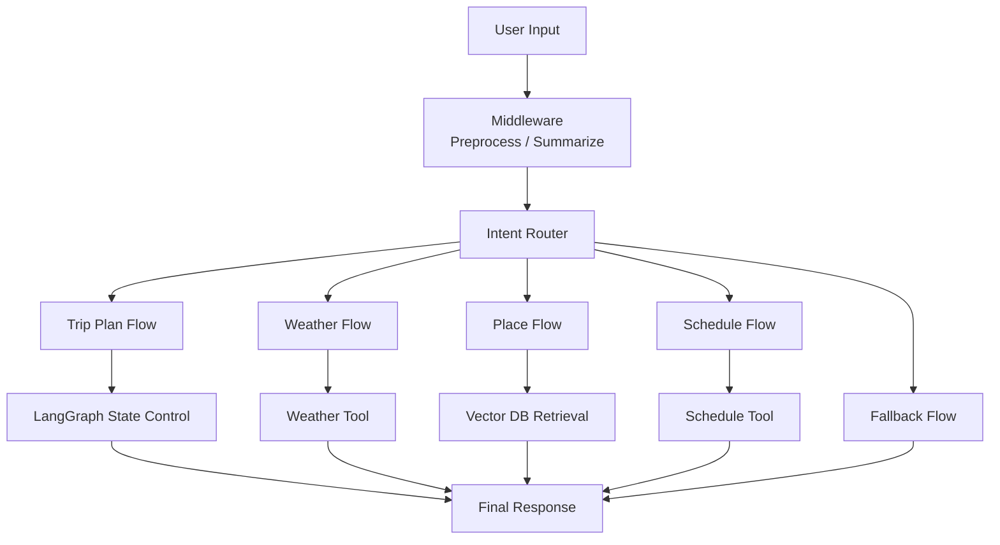
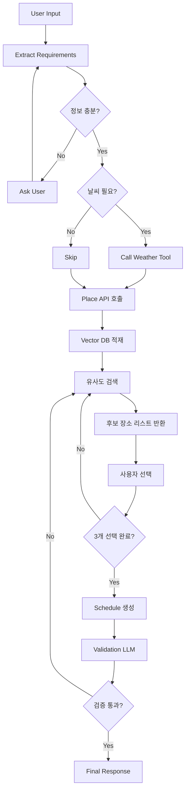
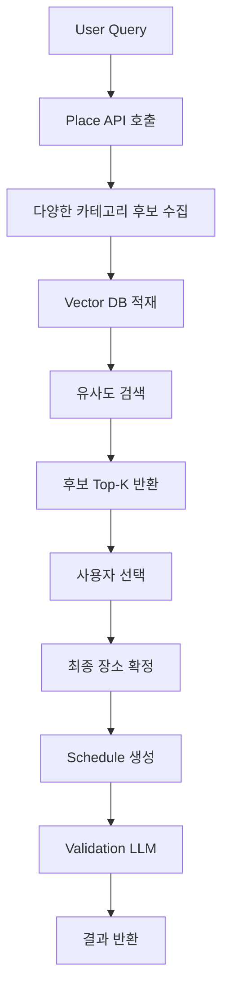

# 🌍 TRIP_DOT_ZIP

> **LLM 기반 대화형 여행 일정 추천 시스템**
> *대화를 통해 여행 조건을 수집하고, 장소를 추천하며, 최종 일정을 생성하는 AI Travel Agent*

---

## 📑 목차 (Table of Contents)

1. [📌 프로젝트 개요](#1--프로젝트-개요)
2. [🖐🏻 팀 소개](#2--팀-소개)
3. [🛠 기술 스택](#3--기술-스택)
4. [🧠 시스템 아키텍처](#4--시스템-아키텍처)
5. [🔁 데이터 흐름 (Trip Plan Flow)](#5--데이터-흐름-trip-plan-flow-기준)
6. [🔀 기타 Flow](#6--기타-flow)
7. [🚀 주요 기능](#7--주요-기능)
8. [🤖 Agentic RAG 구조](#8--agentic-rag-구조)
9. [🧩 State 설계](#9--state-설계)
10. [⚙️ 설계 선택 이유](#10--설계-선택-이유)
11. [📁 프로젝트 구조](#11--프로젝트-구조)
12. [🎬 서비스 시나리오](#12--서비스-시나리오)
13. [💬 동료 회고](#13--동료-회고)

---

## 1. 📌 프로젝트 개요

### 📋 서비스 배경

* 여행 계획은 정보 탐색, 장소 선정, 동선 구성까지 많은 피로도를 요구
* 기존 추천 시스템은 정적인 리스트 제공에 그침

👉 본 프로젝트는
**LLM 기반 Agent 시스템을 활용하여 “대화형 여행 계획 자동화”**를 목표로 한다

---

### 🎯 핵심 목표

* LangGraph 기반 상태 제어형 Agent 구현
* LLM Function Calling 기반 Tool 자동 호출
* 사용자와의 대화를 통한 여행 조건 수집
* 상황(Context)에 맞는 동적 추천
* 최종 일정 자동 생성

---

### 💡 기대 효과

* 여행 준비 시간 단축
* 개인 맞춤형 일정 제공
* 실시간 상황(날씨 등) 반영

---

## 2. 🖐🏻 팀 소개

### Team Trip Dot ZIP

여행의 모든 순간을 연결하는 다섯 마리의 똑똑한 땃쥐들입니다!

<table width="100%" border="0">
  <tr>
    <td width="20%" align="center">
      
    </td>
    <td width="20%" align="center">
      
    </td>
    <td width="20%" align="center">
      
    </td>
    <td width="20%" align="center">
      
    </td>
    <td width="20%" align="center">
      
    </td>
  </tr>

  <tr>
    <td width="20%" align="center"><b>김이선</b></td>
    <td width="20%" align="center"><b>김지윤</b></td>
    <td width="20%" align="center"><b>박은지</b></td>
    <td width="20%" align="center"><b>위희찬</b></td>
    <td width="20%" align="center"><b>홍지윤</b></td>
  </tr>

  <tr>
    <td width="20%" align="center">🛠️ 팀원</td>
    <td width="20%" align="center">✈️ 조장</td>
    <td width="20%" align="center">🌰 팀원</td>
    <td width="20%" align="center">🥜 대장</td>
    <td width="20%" align="center">🗺️ 팀원</td>
  </tr>

  <tr>
    <td width="20%" align="center">middleware 및<br>streamlit 연동</td>
    <td width="20%" align="center">프로젝트 총괄<br>LangGraph 기반 LLM 아키텍처 설계</td>
    <td width="20%" align="center">LangGraph 상태 관리 및 데이터 정합성 로직 고도화<br>멀티 에이전트 노드 설계</td>
    <td width="20%" align="center">기술 아키텍처 설계<br>에이전트 로직 구현</td>
    <td width="20%" align="center">AI 설계<br>데이터 설계<br>상태 관리</td>
  </tr>

  <tr>
    <td width="20%" align="center"><a href="https://github.com/kysuniv-cyber">GitHub</a></td>
    <td width="20%" align="center"><a href="https://github.com/JiyounKim-EllyKim">GitHub</a></td>
    <td width="20%" align="center"><a href="https://github.com/lo1f0306">GitHub</a></td>
    <td width="20%" align="center"><a href="https://github.com/dnlgmlcks">GitHub</a></td>
    <td width="20%" align="center"><a href="https://github.com/jyh-skn">GitHub</a></td>
  </tr>
</table>

---

## 3. 🛠 기술 스택

### Core

* **LLM**: GPT-4o-mini
* **Framework**: LangGraph (State 기반 Flow 제어)

### Data & API

* OpenWeather API
* Google Places API

### Retrieval

* Chroma Vector DB
* SelfQueryRetriever

### Frontend & Visualization

* Streamlit
* Folium

---

## 4. 🧠 시스템 아키텍처



---

## 5. 🔁 데이터 흐름 (Trip Plan Flow 기준)

- 본 데이터 흐름은 전체 시스템 중 가장 핵심적인 "Trip Plan Flow" 기준으로 설명합니다.



👉 사용자와의 상호작용을 통해 점진적으로 결과를 확정하는 구조이다.

---

## 6. 🔀 기타 Flow

Trip Plan Flow 외에도 사용자 요청에 따라 아래와 같은 Flow가 동작합니다.

- **Weather Flow**  
  → 특정 지역 및 날짜의 날씨 정보를 조회하고, 여행 관점에서 해석하여 제공

- **Place Flow**  
  → 일정 생성 없이 장소 추천만 수행 (Vector DB 기반 유사도 검색 활용)

- **Schedule Flow**  
  → 사용자가 선택한 장소 리스트를 기반으로 동선 및 시간표 생성

- **Fallback Flow**  
  → 일반 대화 또는 지원하지 않는 요청에 대한 응답 처리

---

## 7. 🚀 주요 기능

### 1️⃣ 대화형 여행 계획 생성

* 자연어 입력 기반 요구사항 추출
* 부족한 정보 자동 질문
* multi-turn 대화 구조

---

### 2️⃣ 날씨 기반 동적 추천

* Weather API 활용
* 날씨에 따라 추천 변경

---

### 3️⃣ Vector DB 기반 장소 추천 ⭐ (핵심 기능)

* 리뷰 기반 의미 유사도 검색
* 단순 필터링이 아닌 semantic search

---

### 4️⃣ 사용자 선택 기반 장소 확정 ⭐ (핵심 기능)

```text
후보 10개 제공 → 사용자 선택 → 3개 확정
```

---

### 5️⃣ 일정 생성

* 이동 시간 고려
* 동선 최적화

---

### 6️⃣ Validation LLM

* 일정 품질 검증
* 이동 시간 / 흐름 체크

---

## 8. 🤖 Agentic RAG 구조



👉 본 구조는 단순 키워드 검색이 아닌  
**리뷰 기반 의미 유사도 검색을 통해 추천 정확도를 향상시키기 위해 설계되었다**

---

## 9. 🧩 State 설계

본 프로젝트는 LangGraph 기반의 State Machine 구조를 사용하며,  
모든 노드는 `TravelAgentState`를 기반으로 데이터를 주고받는다.

State는 단순 데이터 저장이 아니라,  
👉 **대화 흐름 제어 + Agent 상태 관리 + 데이터 전달 역할**을 동시에 수행한다.

---

### 🔹 1. 전체 구조

State는 크게 다음 6가지 영역으로 나뉜다:

1. 대화 및 라우팅  
2. 여행 조건  
3. 장소 / 일정 / 날씨  
4. 흐름 제어  
5. 응답 및 출력  
6. 안전 및 최적화  

👉 본 State 설계의 핵심은  
**“여행 조건 + 장소 선택 + 흐름 제어” 3가지이다**

---

### 🔹 2. 대화 및 라우팅

- `messages`: 사용자와의 전체 대화 히스토리  
- `intent`: 사용자 의도 분류  
- `confidence`: intent 분류 신뢰도  
- `route`: 어떤 flow로 보낼지 결정  

예시:
- messages → 사용자 대화 기록
- selected_places → 사용자가 선택한 장소 리스트

👉 **LangGraph의 분기점 역할을 담당**

---

### 🔹 3. 여행 조건 (User Context)

- 사용자의 여행 요구사항을 구조화  
- 자연어 → 구조화된 데이터 변환  

예시:
- "조용한 카페" → styles  
- "비 오면 실내" → constraints  

👉 **Agentic RAG 검색 쿼리의 핵심 입력값**

---

### 🔹 4. 장소 / 일정 / 날씨

- `mapped_places`: Vector DB 검색 결과 (후보군)  
- `selected_places`: 사용자가 선택한 최종 장소  
- `itinerary`: 생성된 일정  
- `weather_data`: 날씨 API 결과  

흐름: API → mapped_places → 사용자 선택 → selected_places → itinerary

---

### 🔹 5. 흐름 제어 (Flow Control)

- `missing_slots`: 아직 수집되지 않은 정보  
- `need_weather`: 날씨 호출 여부 판단  
- `state_type_cd`: 현재 상태 코드  
- `quality_check`: 일정 검증 결과  

👉 **조건 분기 및 흐름 제어 핵심**

---

### 🔹 6. 응답 및 기타 상태

- `map_metadata`: 지도 시각화 정보  
- `final_response`: 사용자에게 전달할 최종 응답
- `blocked`: 부적절 입력 차단 여부  
- `blocked_reason`: 차단 이유  
- `conversation_summary`: 대화 요약  
- `conversation_summarized`: 요약 여부  

👉 긴 대화에서 **토큰 절약 및 안정성 확보**

---

### 🔹 7. State Reducer 설계

- keep_and_update: 기존 값 유지하며 부분 업데이트
- overwrite_list: 리스트 전체 교체

---

### 🔹 8. 설계 핵심 포인트

- State를 단순 저장소가 아니라 **Flow 제어 중심 구조로 설계**
- 사용자 입력을 점진적으로 누적
- Agentic RAG / Tool 호출 / Validation을 하나의 흐름으로 통합
- Reducer를 통해 상태 충돌 방지

💡 핵심 특징:
- 사용자 입력이 누적되는 구조
- Flow 분기 조건을 State로 관리
- Agent의 "기억" 역할 수행

---

### 🔹 9. 한 줄 정리

> **TravelAgentState는 LangGraph에서 Agent의 “기억 + 상태 + 흐름 제어”를 모두 담당하는 핵심 구조이다.**

---

## 10. ⚙️ 설계 선택 이유

### LangGraph
→ 복잡한 분기 및 상태 기반 흐름 제어를 위해 선택

### Vector DB
→ 리뷰 기반 의미 검색을 통한 추천 정확도 향상

### 사용자 선택 방식
→ 개인 취향 반영을 위한 핵심 구조

### Validation LLM
→ 일정 품질 자동 검증

---

## 11. 📁 프로젝트 구조

```text
TRIP_DOT_ZIP/
├── main.py                         # 프로젝트 실행 진입점
├── config.py                       # API Key 및 환경 변수 설정
├── constants.py                    # 공통 상수 및 카테고리 매핑
├── requirements.txt                # 프로젝트 의존성 목록
│
├── llm/                            # LLM Agent 및 LangGraph 핵심 로직
│   ├── prompts.py                  # LLM 시스템 프롬프트 관리
│   │
│   ├── graph/                      # LangGraph 구성 모듈
│   │   ├── builder.py              # LangGraph 노드/엣지 연결 및 app 생성
│   │   ├── state.py                # TravelAgentState 정의
│   │   ├── routes.py               # 조건 분기 및 라우팅 함수
│   │   └── contracts.py            # StateKey 등 공통 계약 정의
│   │
│   └── nodes/                      # LangGraph 노드 구현
│       ├── intent_nodes.py         # 사용자 의도 분류 노드
│       ├── trip_nodes.py           # 여행 조건 추출 및 정보 수집 노드
│       ├── weather_nodes.py        # 날씨 조회 노드
│       ├── place_node.py           # Google Places API 호출 및 장소 후보 수집
│       ├── place_search_node.py    # Vector DB 기반 장소 검색 노드
│       ├── schedule_nodes.py       # 일정 생성 노드
│       ├── validate_node.py        # 일정 및 추천 결과 검증 노드
│       ├── safety_nodes.py         # 안전성 검사 노드
│       ├── summary_nodes.py        # 대화 요약 노드
│       └── response_nodes.py       # 최종 응답 생성 노드
│
├── services/                       # 외부 API 및 서비스 로직
│   ├── weather_service.py          # OpenWeather API 연동
│   ├── place_search_service.py     # Google Places API 연동 및 장소 데이터 처리
│   ├── scheduler_service.py        # 일정 생성 서비스
│   ├── map_service.py              # 지도 시각화 서비스
│   ├── intent_service.py           # 의도 분석 서비스
│   └── travel_recommend_service.py # 여행 추천 관련 서비스
│
├── utils/                          # 공통 유틸리티
│   ├── db_util.py                  # Vector DB 적재 파이프라인
│   ├── db_retrieval.py             # Chroma 기반 유사도 검색
│   ├── map_util.py                 # 지도 관련 유틸 함수
│   ├── common_util.py              # 공통 유틸 함수
│   └── custom_exception.py         # 커스텀 예외 처리
│
├── middlewares/                    # 입력 전처리 및 안전성/요약 미들웨어
│   ├── pipeline.py                 # 미들웨어 실행 파이프라인
│   ├── safety_mw.py                # 안전성 검사 미들웨어
│   ├── summary_mw.py               # 대화 요약 미들웨어
│   ├── intent_mw.py                # 의도 관련 미들웨어
│   ├── normalizer.py               # 입력 정규화
│   └── registry.py                 # 미들웨어 등록 관리
│
├── streamlit_app/                  # Streamlit 기반 사용자 인터페이스
│   ├── front/
│   │   ├── app.py                  # Streamlit 메인 화면
│   │   ├── ui.py                   # UI 컴포넌트
│   │   └── tripdotzip.css          # 화면 스타일
│   │
│   └── back/
│       ├── chat_logic.py           # 프론트-LLM 그래프 연결 로직
│       └── session_state.py        # Streamlit 세션 상태 관리
│
├── assets/                         # 이미지 및 정적 리소스
│   ├── styles.css
│   ├── tripdotzip_guide_mouse.png
│   └── tripdotzip_mouse_icon.png
│
├── data/                           # Vector DB 및 데이터 저장 경로
│   └── chroma/
│
├── run_graph_test.py               # 단일 턴 LangGraph 테스트
├── run_graph_multi_turn_test.py    # 멀티 턴 대화 테스트
└── test/                           # 테스트 코드
```

> `__pycache__`, `.idea`, `.pytest_cache`, `test_backup` 등 개발 환경 및 캐시성 파일은 구조 설명에서 제외했습니다.

---

## 12. 🎬 서비스 시나리오

**입력**

> “부산 당일치기, 실내 위주로 가고 싶어”

**출력**

* 장소 추천
* 사용자 선택
* 일정 생성
* 검증 완료 결과

---

## 🧠 한 줄 요약

> **LangGraph 기반 LLM Agent가 사용자와 대화를 통해 여행 조건을 수집하고,  
> Vector DB 기반 의미 검색 + 사용자 선택을 통해 장소를 확정한 뒤,  
> 일정 생성 및 검증까지 수행하는 end-to-end 여행 추천 시스템**

---

## 13. 💬 동료 회고

<div>

<!-- 김지윤 -->
<table style="width:100%; border-collapse: collapse; border:1px solid #ddd;">
<thead><tr style="background-color:#f2f2f2;"><th style="border:1px solid #ddd; padding:8px;">대상자</th><th style="border:1px solid #ddd; padding:8px;">작성자</th><th style="border:1px solid #ddd; padding:8px;">회고 내용</th></tr></thead>
<tbody>
<tr><td rowspan="4" style="text-align:center; border:1px solid #ddd;"><b>김지윤</b></td><td style="text-align:center; border:1px solid #ddd;">김이선</td><td style="border:1px solid #ddd;"></td></tr>
<tr><td style="text-align:center; border:1px solid #ddd;">박은지</td><td style="border:1px solid #ddd;"></td></tr>
<tr><td style="text-align:center; border:1px solid #ddd;">위희찬</td><td style="border:1px solid #ddd;"></td></tr>
<tr><td style="text-align:center; border:1px solid #ddd;">홍지윤</td><td style="border:1px solid #ddd;"></td></tr>
</tbody>
</table>

<br>

<!-- 김이선 -->
<table style="width:100%; border-collapse: collapse; border:1px solid #ddd;">
<thead><tr style="background-color:#f2f2f2;"><th style="border:1px solid #ddd; padding:8px;">대상자</th><th style="border:1px solid #ddd; padding:8px;">작성자</th><th style="border:1px solid #ddd; padding:8px;">회고 내용</th></tr></thead>
<tbody>
<tr><td rowspan="4" style="text-align:center; border:1px solid #ddd;"><b>김이선</b></td><td style="text-align:center; border:1px solid #ddd;">김지윤</td><td style="border:1px solid #ddd;"></td></tr>
<tr><td style="text-align:center; border:1px solid #ddd;">박은지</td><td style="border:1px solid #ddd;"></td></tr>
<tr><td style="text-align:center; border:1px solid #ddd;">위희찬</td><td style="border:1px solid #ddd;"></td></tr>
<tr><td style="text-align:center; border:1px solid #ddd;">홍지윤</td><td style="border:1px solid #ddd;"></td></tr>
</tbody>
</table>

<br>

<!-- 박은지 -->
<table style="width:100%; border-collapse: collapse; border:1px solid #ddd;">
<thead><tr style="background-color:#f2f2f2;"><th style="border:1px solid #ddd; padding:8px;">대상자</th><th style="border:1px solid #ddd; padding:8px;">작성자</th><th style="border:1px solid #ddd; padding:8px;">회고 내용</th></tr></thead>
<tbody>
<tr><td rowspan="4" style="text-align:center; border:1px solid #ddd;"><b>박은지</b></td><td style="text-align:center; border:1px solid #ddd;">김지윤</td><td style="border:1px solid #ddd;"></td></tr>
<tr><td style="text-align:center; border:1px solid #ddd;">김이선</td><td style="border:1px solid #ddd;"></td></tr>
<tr><td style="text-align:center; border:1px solid #ddd;">위희찬</td><td style="border:1px solid #ddd;"></td></tr>
<tr><td style="text-align:center; border:1px solid #ddd;">홍지윤</td><td style="border:1px solid #ddd;"></td></tr>
</tbody>
</table>

<br>

<!-- 위희찬 -->
<table style="width:100%; border-collapse: collapse; border:1px solid #ddd;">
<thead><tr style="background-color:#f2f2f2;"><th style="border:1px solid #ddd; padding:8px;">대상자</th><th style="border:1px solid #ddd; padding:8px;">작성자</th><th style="border:1px solid #ddd; padding:8px;">회고 내용</th></tr></thead>
<tbody>
<tr><td rowspan="4" style="text-align:center; border:1px solid #ddd;"><b>위희찬</b></td><td style="text-align:center; border:1px solid #ddd;">김지윤</td><td style="border:1px solid #ddd;"></td></tr>
<tr><td style="text-align:center; border:1px solid #ddd;">김이선</td><td style="border:1px solid #ddd;"></td></tr>
<tr><td style="text-align:center; border:1px solid #ddd;">박은지</td><td style="border:1px solid #ddd;"></td></tr>
<tr><td style="text-align:center; border:1px solid #ddd;">홍지윤</td><td style="border:1px solid #ddd;"></td></tr>
</tbody>
</table>

<br>

<!-- 홍지윤 -->
<table style="width:100%; border-collapse: collapse; border:1px solid #ddd;">
<thead><tr style="background-color:#f2f2f2;"><th style="border:1px solid #ddd; padding:8px;">대상자</th><th style="border:1px solid #ddd; padding:8px;">작성자</th><th style="border:1px solid #ddd; padding:8px;">회고 내용</th></tr></thead>
<tbody>
<tr><td rowspan="4" style="text-align:center; border:1px solid #ddd;"><b>홍지윤</b></td><td style="text-align:center; border:1px solid #ddd;">김지윤</td><td style="border:1px solid #ddd;"></td></tr>
<tr><td style="text-align:center; border:1px solid #ddd;">김이선</td><td style="border:1px solid #ddd;"></td></tr>
<tr><td style="text-align:center; border:1px solid #ddd;">박은지</td><td style="border:1px solid #ddd;"></td></tr>
<tr><td style="text-align:center; border:1px solid #ddd;">위희찬</td><td style="border:1px solid #ddd;"></td></tr>
</tbody>
</table>

</div>

---